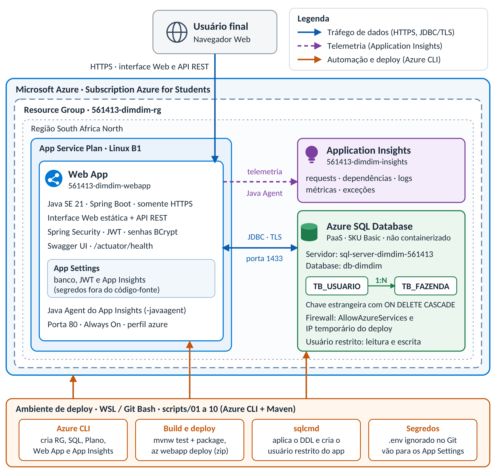

# DimDim — aplicações e banco em nuvem

Aplicação Web e API REST Java para gerenciar usuários e suas fazendas, preparada para o checkpoint de Cloud Computing da FIAP. A solução usa Java 21, Spring Boot, Azure App Service Linux, Azure SQL Database PaaS e Azure Application Insights. O deploy é executado pela Azure CLI com `az webapp deploy`; não utiliza Docker, ACI, ACR ou GitHub Actions.

> 🎥 **Vídeo de demonstração:** [https://www.youtube.com/watch?v=NGtYeb7sk0Y](https://www.youtube.com/watch?v=NGtYeb7sk0Y)
>
> ⚠️ **A aplicação não está mais no ar.** Depois de gravar a demonstração, todos os recursos foram removidos com `scripts/99-teardown.sh` para não consumir os créditos do Azure com uptime. As URLs `https://561413-dimdim-webapp.azurewebsites.net` deixaram de responder; o comportamento completo está no vídeo acima. Para publicá-la de novo, siga [Criação da infraestrutura e deploy](#criação-da-infraestrutura-e-deploy).

## Objetivo

Demonstrar uma aplicação Web publicada na Azure, com persistência relacional real, operações CRUD completas nas duas entidades e telemetria da aplicação. Um usuário pode possuir várias fazendas; a relação existe no Azure SQL por meio de uma chave estrangeira.

## Tecnologias

- Java 21, Spring Boot e Maven.
- Spring Data JPA com Microsoft SQL Server JDBC Driver.
- Spring Security stateless com JWT e senha armazenada por hash BCrypt.
- Azure App Service Linux (Java SE 21).
- Azure SQL Server lógico e Azure SQL Database (PaaS).
- Azure Application Insights com o Java Agent oficial.
- Azure CLI, `az webapp deploy`, `sqlcmd`, `curl` e `zip`.
- Springdoc OpenAPI / Swagger UI.

## Arquitetura

O browser acessa o frontend estático e a API REST no mesmo App Service. A API se conecta por JDBC/TLS ao Azure SQL Database. O Application Insights Java Agent instrumenta a aplicação e envia telemetria ao recurso Application Insights.



Uma versão textual do desenho (Mermaid) está em [`docs/architecture.md`](docs/architecture.md).

## Estrutura do projeto

```text
src/main/java/br/com/fiap/dimdim/  controllers, services, entities, DTOs e repositories
src/main/resources/static/         interface web
src/test/                           testes de integração HTTP usando H2 somente em testes
scripts/                            DDL e etapas do deploy (01 a 10), teardown (99) e orquestrador
docs/api/                           exemplos JSON das operações REST
docs/architecture.md                desenho da arquitetura (Mermaid)
docs/img/                           imagem do diagrama de arquitetura
```

## Pré-requisitos

- JDK 21 e Azure CLI instalados.
- Maven Wrapper incluído (`mvnw`); não é necessário instalar Maven.
- Bash (WSL ou Git Bash no Windows), `curl`, `zip` e `sqlcmd`.
- Uma subscription Azure com permissões para criar Resource Group, Azure SQL, App Service e Application Insights.
- Acesso de rede do host do deploy ao Azure SQL (o `CLIENT_IP` é detectado e liberado no firewall; veja [Variáveis de ambiente](#variáveis-de-ambiente)).

## Configuração local

Crie seu arquivo local de variáveis (ele não deve ser versionado):

```bash
cp .env.example .env
```

Preencha no `.env` os nomes dos recursos, o login administrativo do servidor SQL, o usuário contido da aplicação e o `JWT_SECRET`. Use senhas próprias e fortes; não as inclua em commits, screenshots públicos ou vídeos.

Para iniciar localmente conectado ao Azure SQL já criado:

```bash
set -a
source .env
set +a
export DATABASE_URL="jdbc:sqlserver://${SQL_SERVER_NAME}.database.windows.net:1433;database=${SQL_DATABASE_NAME};encrypt=true;trustServerCertificate=false;hostNameInCertificate=*.database.windows.net;loginTimeout=30"
bash ./mvnw spring-boot:run
```

A aplicação usa `DATABASE_URL`, `DATABASE_USERNAME` e `DATABASE_PASSWORD`. Em Azure, elas são definidas como App Settings. Não há banco local de substituição em execução normal; H2 é utilizado exclusivamente pelo perfil de testes.

## Variáveis de ambiente

Consulte [`.env.example`](.env.example). As variáveis sensíveis obrigatórias para provisionamento são:

- `SQL_ADMIN_USERNAME` e `SQL_ADMIN_PASSWORD`: login administrativo do Azure SQL usado apenas pelo script de inicialização.
- `DATABASE_USERNAME` e `DATABASE_PASSWORD`: usuário contido com acesso CRUD ao database, utilizado pela aplicação.
- `JWT_SECRET`: chave aleatória com pelo menos 32 bytes para assinatura dos tokens; `JWT_EXPIRATION` é a validade em milissegundos.

Gere `JWT_SECRET` localmente com `openssl rand -base64 32` e guarde o valor apenas no `.env` (e nos App Settings do Azure). Não use uma chave de exemplo em produção.

As principais variáveis de nomenclatura têm valores padrão, mas podem ser alteradas no `.env`: `RM`, `RESOURCE_GROUP`, `SQL_SERVER_NAME`, `SQL_DATABASE_NAME`, `APP_SERVICE_PLAN`, `WEB_APP_NAME` e `APP_INSIGHTS_NAME`. O nome de Web App precisa ser globalmente único.

Variáveis de região e rede:

| Variável | Obrigatória | Padrão | Descrição |
|---|---|---|---|
| `LOCATION` | não | `southcentralus` | Região do Resource Group, App Service Plan, Web App e Application Insights. |
| `SQL_LOCATION` | não | valor de `LOCATION` | Região do Azure SQL Server. Use outra região apenas se a primeira não tiver capacidade para SQL. |
| `CLIENT_IP` | não | detectado automaticamente | IPv4 público do host que executa o deploy; pode ser informado manualmente se a detecção falhar. |

> **Região usada neste projeto: `southafricanorth`.** O App Service Plan, o Web App, o Application Insights e o Azure SQL foram criados em `southafricanorth` (`LOCATION=southafricanorth` e `SQL_LOCATION=southafricanorth` no `.env`). O padrão `southcentralus` não funcionou na subscription Azure for Students usada: o Azure SQL está bloqueado ali para a subscription e não há quota de App Service B1 (`Current Limit (B1 VMs): 0`). Além disso, uma política da subscription (`Allowed resource deployment regions`) só permite criar recursos em `southafricanorth`, `spaincentral`, `southcentralus`, `eastus` e `chilecentral`. O Resource Group em si foi criado em `southcentralus`, o que não impede que seus recursos fiquem em outra região. Se for reproduzir o deploy, rode a etapa 01 e ajuste as variáveis conforme a sua subscription.

Em produção a aplicação roda com `SPRING_PROFILES_ACTIVE=azure`, que carrega [`application-azure.properties`](src/main/resources/application-azure.properties): o pool Hikari não derruba a subida se o banco estiver indisponível (`initialization-fail-timeout=-1`), o Hibernate não consulta metadados JDBC na inicialização e os probes de health do Actuator ficam habilitados. Essas propriedades existem somente nesse perfil; os testes (perfil `test`, H2) não são afetados. No App Service a aplicação escuta na porta 80 (`-Dserver.port=80`), que é a porta sondada pela imagem Java embutida (ela ignora `WEBSITES_PORT`); localmente o padrão continua 8080. Always On fica ativado. `AZURE_SUBSCRIPTION_ID` é opcional se a subscription correta já estiver ativa.

`CLIENT_IP` é o IPv4 público exato do host que executa o deploy e `sqlcmd`; é detectado automaticamente e só precisa ser definido se a detecção falhar. O fluxo automatizado o utiliza para inicializar Azure SQL. Isso cria somente uma regra individual chamada `AllowTemporaryClientIP`. O valor especial `0.0.0.0` a `0.0.0.0` da regra `AllowAzureServices` permite conexões originadas em serviços hospedados no Azure e não é uma liberação universal. Remova a regra temporária após o trabalho:

```bash
az sql server firewall-rule delete \
  --resource-group "$RESOURCE_GROUP" \
  --server "$SQL_SERVER_NAME" \
  --name AllowTemporaryClientIP
```

## Azure SQL

O DDL idempotente está em [`scripts/azure-sql.sql`](scripts/azure-sql.sql): cria `TB_USUARIO`, `TB_FAZENDA`, PKs, FK com `ON DELETE CASCADE`, restrição positiva para a área e índice da FK.

A etapa [`04-sql-schema.sh`](scripts/04-sql-schema.sh) aplica o DDL e cria/atualiza o usuário contido da aplicação, dando apenas `db_datareader` e `db_datawriter`. Requer `sqlcmd` e conectividade permitida pelo firewall. As contas de demonstração são criadas pelo endpoint de registro para que a senha seja armazenada com hash BCrypt.

## Criação da infraestrutura e deploy

> **⚠️ AVISO — não crie App Service Plan em loop nem rode teardown entre tentativas.** Criar e apagar planos repetidamente na mesma região pode fazer a Azure bloquear a capacidade daquela região por tempo prolongado. Todas as etapas são idempotentes (reutilizam o que já existe): se algo falhar, **corrija e rode novamente somente a etapa que falhou** e as seguintes. Rode o preflight (etapa 01) antes de qualquer criação e só rode o teardown ao final do trabalho.

1. Copie e preencha `.env`.
2. Faça login e confirme a subscription:

   ```bash
   az login
   if [[ -n "${AZURE_SUBSCRIPTION_ID:-}" ]]; then
     az account set --subscription "$AZURE_SUBSCRIPTION_ID"
   fi
   az account show --output table
   ```

3. Gere e preencha `JWT_SECRET` (`openssl rand -base64 32`). `LOCATION` (padrão `southcentralus`), `SQL_LOCATION` e `CLIENT_IP` são opcionais.
4. Execute as etapas, uma a uma, na ordem abaixo.

### Etapas do deploy

O deploy é dividido em scripts numerados em [`scripts/`](scripts/), cada um com uma única responsabilidade. Todos compartilham a configuração de [`common.sh`](scripts/common.sh) (carga do `.env`, nomes dos recursos e região).

| Etapa | Comando | Responsabilidade |
|---|---|---|
| 01 | `bash scripts/01-preflight.sh` | Somente leitura: variáveis do `.env`, ferramentas, login, IP público e disponibilidade da região (B1 Linux e SQL Basic). Não cria nada. |
| 02 | `bash scripts/02-resource-group.sh` | Registra os resource providers e cria o Resource Group. |
| 03 | `bash scripts/03-sql-database.sh` | Cria o Azure SQL Server, as regras de firewall (`AllowAzureServices` e IP exato da máquina) e o database Basic. |
| 04 | `bash scripts/04-sql-schema.sh` | Aplica o DDL (`azure-sql.sql`) e cria o usuário restrito da aplicação. |
| 05 | `bash scripts/05-app-service.sh` | Cria o App Service Plan Linux B1 (uma única tentativa) e o Web App Java 21, somente HTTPS. |
| 06 | `bash scripts/06-app-insights.sh` | Cria o Application Insights. |
| 07 | `bash scripts/07-build.sh` | Roda os testes, gera o JAR (`./mvnw clean package`), baixa o agente Java do Application Insights (3.7.9) e monta o zip. |
| 08 | `bash scripts/08-configure-webapp.sh` | Aplica os App Settings (banco, JWT, Application Insights, porta 80, perfil `azure`), Always On e o comando de inicialização. |
| 09 | `bash scripts/09-deploy.sh` | Publica o zip com `az webapp deploy`. |
| 10 | `bash scripts/10-validate.sh` | Valida a aplicação em duas fases (veja [Validação](#validação)). |
| 99 | `bash scripts/99-teardown.sh` | Remove o Resource Group (somente ao final, com confirmação). |

Para executar várias etapas em sequência (parando na primeira falha), use o orquestrador [`azure-deploy.sh`](scripts/azure-deploy.sh):

| Comando | O que faz |
|---|---|
| `bash scripts/azure-deploy.sh` | Etapas 01 a 10 (fluxo completo). |
| `bash scripts/azure-deploy.sh 02 06` | Somente infraestrutura e banco. |
| `bash scripts/azure-deploy.sh 07` | Ciclo rápido de correções: build, configuração, deploy e validação, sem recriar a infraestrutura. |

Cada etapa grava seu log em `logs/<etapa>-<timestamp>.log` e termina com o tempo gasto e o resultado; confira que o log não contém segredos antes de compartilhá-lo.

O Application Insights connection string é consultado no recurso Azure durante o deploy e armazenado apenas nos App Settings do Web App (`APPLICATIONINSIGHTS_CONNECTION_STRING`). O agente Java é iniciado com `-javaagent` e coleta telemetria de requests, dependências, logs, métricas e exceções. Nenhum connection string é salvo no repositório.

Se o `WEB_APP_NAME` padrão já estiver ocupado, escolha outro valor globalmente único no `.env` e rode novamente a partir da etapa 05. `RESOURCE_GROUP` define o escopo removido pelo teardown.

## Validação

A etapa 10 valida a aplicação em duas fases:

1. `GET /` — confirma que o container subiu e responde na porta 80 (não depende do banco).
2. `GET /actuator/health` — confirma a aplicação e a conexão com o Azure SQL (o health do Spring Boot inclui o datasource).

Se alguma fase falhar por tempo, a etapa coleta automaticamente os logs do App Service.

Por padrão a etapa valida `https://<WEB_APP_NAME>.azurewebsites.net`; para outra URL, defina `BASE_URL`. As APIs CRUD exigem JWT e não são chamadas sem autenticação pelo script:

```bash
BASE_URL="https://561413-dimdim-webapp.azurewebsites.net" bash scripts/10-validate.sh
```

Interpretação rápida: `/` OK e health OK = tudo certo; `/` OK e health `DOWN` = problema de banco/credenciais; `/` sem resposta = problema no container ou na porta.

URLs da aplicação enquanto estava publicada (**fora do ar** após o teardown; ficam disponíveis novamente se o deploy for refeito com o mesmo `WEB_APP_NAME`):

- Interface Web: <https://561413-dimdim-webapp.azurewebsites.net/>
- Swagger UI: <https://561413-dimdim-webapp.azurewebsites.net/swagger>
- OpenAPI JSON: <https://561413-dimdim-webapp.azurewebsites.net/api-docs>
- Health: <https://561413-dimdim-webapp.azurewebsites.net/actuator/health>

## Testes

```bash
bash ./mvnw --batch-mode clean test
bash ./mvnw --batch-mode clean package
```

Os testes exercitam autenticação JWT, endpoints protegidos, validação, busca de recurso inexistente, operações CRUD e o relacionamento Usuário–Fazenda. H2 é carregado pelo perfil `test`, sem mudar a configuração de produção `spring.jpa.hibernate.ddl-auto=none`.

## Endpoints e exemplos

As operações CRUD completas estão disponíveis para ambas as entidades:

| Entidade | Listar | Buscar por ID | Criar | Atualizar | Excluir |
|---|---|---|---|---|---|
| Usuário | `GET /api/usuarios` | `GET /api/usuarios/{id}` | `POST /api/usuarios` | `PUT /api/usuarios/{id}` | `DELETE /api/usuarios/{id}` |
| Fazenda | `GET /api/fazendas` | `GET /api/fazendas/{id}` | `POST /api/fazendas` | `PUT /api/fazendas/{id}` | `DELETE /api/fazendas/{id}` |

Para criar a primeira conta, use `POST /api/auth/register`; para obter um token depois, use `POST /api/auth/login`. Os endpoints CRUD requerem `Authorization: Bearer <token>`. Swagger permite inserir o token pelo botão **Authorize**. Senhas são armazenadas como hash BCrypt, nunca retornadas pela API. Fazendas podem ser filtradas por responsável com `GET /api/fazendas?usuarioId=1`. A criação e atualização de fazenda requerem `usuarioId` válido.

Os exemplos de request/response estão em [`docs/api/`](docs/api/):

- [`usuario-get.json`](docs/api/usuario-get.json), [`usuario-post.json`](docs/api/usuario-post.json), [`usuario-put.json`](docs/api/usuario-put.json), [`usuario-delete.json`](docs/api/usuario-delete.json).
- [`fazenda-get.json`](docs/api/fazenda-get.json), [`fazenda-post.json`](docs/api/fazenda-post.json), [`fazenda-put.json`](docs/api/fazenda-put.json), [`fazenda-delete.json`](docs/api/fazenda-delete.json).

### Exemplo de uso do CRUD (How To)

Defina a URL do Web App, registre o primeiro usuário (a resposta contém o JWT e o `id`) e copie o token e ID retornados:

```bash
export BASE_URL="https://561413-dimdim-webapp.azurewebsites.net"
curl -i -X POST "$BASE_URL/api/auth/register" -H "Content-Type: application/json" \
  -d '{"nome":"Responsável","email":"responsavel@example.com","senha":"senha-forte-exemplo"}'
export TOKEN="<copie-o-token-retornado>"
export OWNER_ID="<copie-o-id-retornado>"
```

Use o token para o CRUD de usuários e fazendas:

```bash
curl -H "Authorization: Bearer $TOKEN" "$BASE_URL/api/usuarios"
curl -i -X POST "$BASE_URL/api/usuarios" -H "Authorization: Bearer $TOKEN" \
  -H "Content-Type: application/json" \
  -d '{"nome":"Ana Silva","email":"ana@example.com","senha":"senha-forte-exemplo"}'
export USER_ID="<copie-o-id-do-usuario-criado>"
curl -i -X PUT "$BASE_URL/api/usuarios/$USER_ID" -H "Authorization: Bearer $TOKEN" \
  -H "Content-Type: application/json" \
  -d '{"nome":"Ana Souza","email":"ana.souza@example.com"}'
```

Crie uma fazenda usando o ID do usuário criado:

```bash
curl -i -X POST "$BASE_URL/api/fazendas" -H "Authorization: Bearer $TOKEN" \
  -H "Content-Type: application/json" \
  -d "{\"usuarioId\":$USER_ID,\"nome\":\"Fazenda Horizonte\",\"cidade\":\"Ribeirao Preto\",\"estado\":\"SP\",\"areaHectares\":120.50}"
curl -H "Authorization: Bearer $TOKEN" "$BASE_URL/api/fazendas"
export FARM_ID="<copie-o-id-da-fazenda-criada>"
curl -i -X PUT "$BASE_URL/api/fazendas/$FARM_ID" -H "Authorization: Bearer $TOKEN" \
  -H "Content-Type: application/json" \
  -d "{\"usuarioId\":$USER_ID,\"nome\":\"Fazenda Horizonte II\",\"cidade\":\"Ribeirao Preto\",\"estado\":\"SP\",\"areaHectares\":135.00}"
```

Depois de registrar as criações e atualizações, consulte a persistência no Azure SQL e exclua primeiro a fazenda e depois o usuário:

```bash
sqlcmd -S "tcp:${SQL_SERVER_NAME}.database.windows.net,1433" -d "$SQL_DATABASE_NAME" \
  -U "$SQL_ADMIN_USERNAME" -P "$SQL_ADMIN_PASSWORD" -N \
  -Q "SELECT * FROM dbo.TB_USUARIO; SELECT * FROM dbo.TB_FAZENDA;"
curl -i -X DELETE "$BASE_URL/api/fazendas/$FARM_ID" -H "Authorization: Bearer $TOKEN"
curl -i -X DELETE "$BASE_URL/api/usuarios/$USER_ID" -H "Authorization: Bearer $TOKEN"
```

IDs são identity e aumentam; use sempre os IDs retornados pelas respostas reais, não presuma que serão `1`.

## Application Insights

Após o deploy, abra o recurso Application Insights configurado em `APP_INSIGHTS_NAME` no portal Azure. Use **Investigate > Transaction search** ou **Logs** para demonstrar requests/dependências; acesse a página e execute chamadas CRUD antes de consultar. A ingestão pode levar alguns minutos. O script também mostra o App Service URL e registra o connection string apenas na configuração do recurso.

## Vídeo de demonstração

▶️ **[Assistir no YouTube](https://www.youtube.com/watch?v=NGtYeb7sk0Y)**

O vídeo mostra:

1. Os recursos no Azure: App Service, Azure SQL e Application Insights.
2. A execução das etapas `scripts/01-preflight.sh` a `scripts/10-validate.sh`, uma a uma, incluindo build/testes e o deploy com `az webapp deploy`.
3. A interface Web ou Swagger, com CREATE, READ, UPDATE e DELETE de Usuário e Fazenda.
4. Consultas no Azure SQL após as operações, demonstrando a persistência e a chave estrangeira.
5. Requests e telemetria no Application Insights.

## Troubleshooting

- **Região sem capacidade para SQL ou B1**: erros como `RegionDoesNotAllowProvisioning`, `RequestDisallowedByAzure`, "Subscriptions are restricted from provisioning in this region" ou "Operation cannot be completed without additional quota (Current Limit (B1 VMs): 0)". Assinaturas Azure for Students têm regiões e quotas restritas; este projeto usou `southafricanorth`. Rode a etapa 01 (preflight), defina `SQL_LOCATION` com outra região (o SQL pode ficar em região diferente do App Service) ou altere `LOCATION`. Não crie e apague planos repetidamente (veja o aviso acima).
- **Firewall demorando a propagar**: a regra do `CLIENT_IP` pode levar alguns minutos para valer. Se o `sqlcmd` falhar logo após criar a regra, aguarde e repita; não amplie a faixa de IPs.
- **Container não responde na porta**: `/` não responde dentro do tempo. Confirme que o comando de inicialização usa `-Dserver.port=80`: a imagem Java do App Service sonda a porta 80 e ignora `WEBSITES_PORT` (o log `*_docker.log` mostra `Port mismatch detected` quando há divergência); leia os logs coletados pela etapa 10 (e os `logs/*.log`) procurando, por exemplo, `JWT_SECRET` inválido/curto, que impede a aplicação de subir. Corrija e rode `bash scripts/azure-deploy.sh 07`.
- **Health `DOWN` com `/` OK**: a aplicação subiu, mas o banco não responde. Verifique `DATABASE_URL`, `DATABASE_USERNAME` e `DATABASE_PASSWORD` nos App Settings, a regra `AllowAzureServices` e se o usuário contido foi criado pela etapa 04. Corrija e rode `bash scripts/azure-deploy.sh 08`.
- **Erro de firewall/timeout SQL**: confirme `CLIENT_IP`, a regra temporária e se `AllowAzureServices` existe. Não abra uma faixa ampla.
- **Login SQL falha**: confira `SQL_ADMIN_USERNAME`, `SQL_ADMIN_PASSWORD`, `DATABASE_USERNAME` e `DATABASE_PASSWORD`; confirme que `DATABASE_USERNAME` difere do administrador e rode novamente `bash scripts/04-sql-schema.sh`.
- **JWT inválido/401**: confirme o token Bearer e `JWT_SECRET`; o valor da chave não pode mudar entre a emissão e validação do token.
- **Nome de Web App ocupado**: altere `WEB_APP_NAME` para um nome globalmente único.
- **Erro real aparecendo como 401**: a rota `/error` e `/actuator/health/**` são públicas, então falhas de endpoints públicos aparecem com o status real em vez de 401.
- **Aplicação retorna 500 no deploy**: valide que o DDL foi executado, confira App Settings e logs de diagnóstico do App Service.
- **Telemetria não aparece imediatamente**: gere requests na aplicação e aguarde alguns minutos; confirme `APPLICATIONINSIGHTS_CONNECTION_STRING` nos App Settings.
- **`sqlcmd` ausente**: instale o SQL Server Command Line Utilities para seu sistema e confirme `sqlcmd --version`.

## Teardown

O teardown pede o nome completo do Resource Group; nenhuma exclusão ocorre sem confirmação exata:

```bash
bash scripts/99-teardown.sh
```

**Estado atual:** o teardown já foi executado após a gravação do vídeo; o Resource Group, o Azure SQL, o App Service e o Application Insights deste projeto não existem mais.

Não rode o teardown entre tentativas de deploy (veja o aviso em [Criação da infraestrutura e deploy](#criação-da-infraestrutura-e-deploy)); use-o somente depois de salvar as evidências. Confirme que o Resource Group configurado é exclusivo do projeto. O comando exclui o grupo e todos os seus recursos/dados de forma assíncrona.

## Integrantes

| Nome | RM |
|---|---:|
| Lucas Grillo Alcântara | 561413 |
| Pietro Ferreira Gomes Abrahamian | 561469 |
| Pedro Peres Benitez | 561792 |
| Lucca Ramos Mussumecci | 562027 |

## Checklist do Checkpoint

### Aplicação
- [x] Java
- [x] Web App
- [x] Não é Sprint 3
- [x] Deploy Azure

### Banco
- [x] Azure SQL
- [x] PaaS
- [x] 2 tabelas relacionadas
- [x] CRUD tabela 1
- [x] CRUD tabela 2

### Azure
- [x] Azure CLI
- [x] App Service
- [x] Application Insights
- [x] az webapp deploy

### GitHub
- [x] Descrição
- [x] Arquitetura
- [x] DDL
- [x] Scripts CLI
- [x] Código
- [x] How To
- [x] JSON
- [x] Vídeo

### Segurança
- [x] Sem credenciais no código
- [x] .env ignorado
- [x] Sem tokens versionados

### Vídeo
- [x] Criação dos recursos
- [x] Deploy
- [x] Testes
- [x] CRUD tabela 1
- [x] CRUD tabela 2
- [x] Persistência no Azure SQL
- [x] Application Insights
