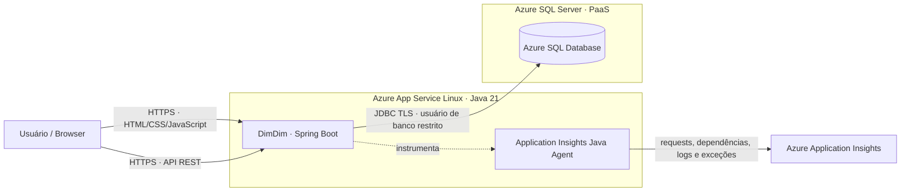

# Arquitetura DimDim

O frontend estático e a API são servidos pela mesma aplicação Spring Boot. O Azure SQL é um serviço PaaS independente, e não há containers ou imagens Docker no caminho de implantação.
